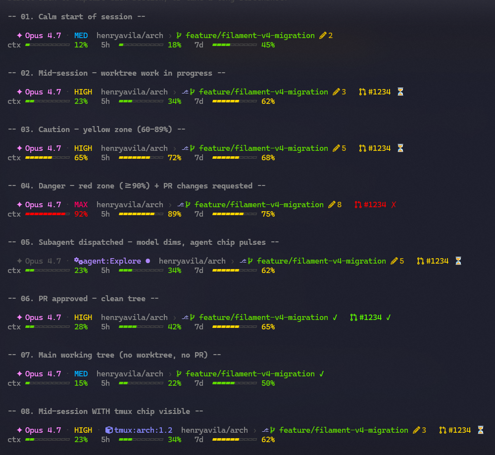
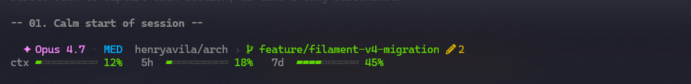
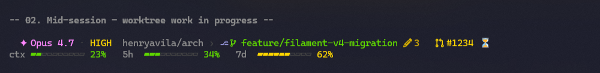
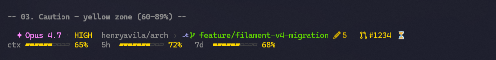
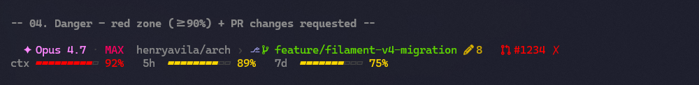
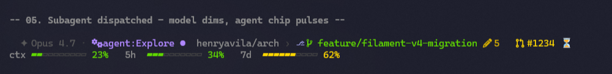
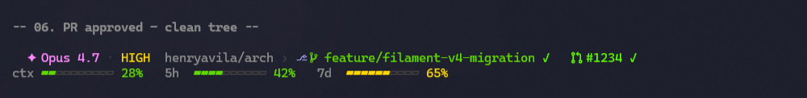
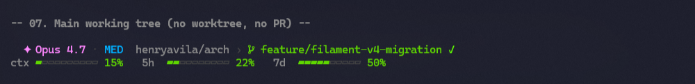
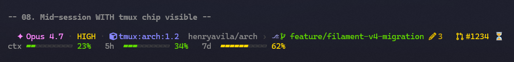

# claudebar

A two-row, zone-driven statusline for [Claude Code](https://docs.claude.com/en/docs/claude-code/overview). Designed for the subscriber tier: rate-limit awareness matters more than dollar cost.

<p align="center">
  
</p>

## What it does

Reads the JSON [session context](https://code.claude.com/docs/en/statusline#available-data) Claude Code feeds it via stdin after every message, and prints two ANSI-colored rows:

```
✦ Opus 4.7 · HIGH · tmux:session:1.2  owner/repo › ⎇  branch  3   #1234 ⏳
ctx ▰▰▱▱▱▱▱▱▱▱ 23%   5h  ▰▰▰▱▱▱▱▱▱▱ 34%   7d  ▰▰▰▰▰▰▱▱▱▱ 62%
```

Identity row (top) — *what session is this?*
Fuel-gauge row (bottom) — *how much runway do I have?*

## Features

- **Pip-style fuel gauges** with **zone-driven colors**: green `<60%`, yellow `60-89%`, red `≥90%` — applied independently to context window, 5-hour rate limit, and 7-day rate limit. The bar shape tells you "how full"; the color tells you "how worried".
- **Identity row** shows model, [reasoning effort](https://docs.claude.com/en/api/messages#extended-thinking), tmux pane context, repo, worktree, branch, dirty file count, and PR review state.
- **Agent-active mode**: when a subagent is dispatched, the model name dims and a pulsing chip shows the agent name — at-a-glance "my turn is paused".
- **Tmux integration**: when running inside tmux, the identity row gains a `tmux:session:window.pane` chip to disambiguate multiple Claude sessions across panes.
- **Graceful degradation**: rate-limit bars hide when not on a subscriber tier; PR chip hides without a PR; effort chip hides on models without effort support; worktree marker hides outside worktrees. No placeholder text, no orphan separators.
- **Cross-platform**: macOS, Ubuntu/Debian, Arch, Fedora, WSL2 — same bash script, no edits.

### Each state at a glance

| State | Render |
|---|---|
| **Calm** — start of session, low context, clean tree |  |
| **Mid-session** — worktree, dirty tree, PR pending |  |
| **Caution** — yellow zone (60-89%) |  |
| **Danger** — red zone (≥90%) + PR changes requested |  |
| **Subagent dispatched** — model dims, agent chip pulses |  |
| **PR approved** — clean tree, green PR chip |  |
| **Main working tree** — no worktree, no PR, minimal chrome |  |
| **Tmux integration** — `tmux:session:window.pane` chip |  |

## Install

### Prerequisites

- bash 4+ (macOS users: `brew install bash`)
- `jq`
- `git`
- A 256-color terminal (anything modern)
- A [Nerd Font](https://www.nerdfonts.com/) installed and active in your terminal

### Quick: one-shot installer

```bash
git clone https://github.com/henryavila/claudebar.git ~/claudebar
~/claudebar/install.sh
```

The installer:

1. Validates all prerequisites with platform-specific install hints (`apt` / `brew` / `pacman` / `dnf`) if anything's missing.
2. Asks you to visually confirm Nerd Font glyphs render correctly (no install attempt — just a check).
3. Timestamp-backs up `~/.claude/settings.json`.
4. Patches the `statusLine` block via `jq` to point at the script.

Send any message in Claude Code (or restart it) — the new statusline renders.

### Manual

Skip the installer if you'd rather edit by hand. Add this block to `~/.claude/settings.json`:

```json
"statusLine": {
  "type": "command",
  "command": "~/claudebar/statusline.sh",
  "padding": 0,
  "refreshInterval": 30
}
```

`refreshInterval: 30` re-runs the script every 30 seconds so rate limits and git status stay current during idle periods (when there's no new message to trigger the natural re-render).

## Uninstall

```bash
~/claudebar/uninstall.sh
```

Lists every backup the installer created, defaults to the most recent, restores it (and snapshots the current state first in case you change your mind). Files are left in place — `rm -rf ~/claudebar` once you're sure.

To re-enable later: re-run `install.sh`.

### Manual rollback

```bash
ls ~/.claude/settings.json.bak-*
cp ~/.claude/settings.json.bak-<TIMESTAMP> ~/.claude/settings.json
```

## How it works

Claude Code pipes a [JSON object](https://code.claude.com/docs/en/statusline#available-data) to the script's stdin after every assistant message (debounced 300ms) plus on a 30-second tick (when configured). The script:

1. Parses every needed field in a single `jq -r` invocation using `@sh` for shell-safe quoting.
2. Derives the current git branch and dirty-file count, with a 5-second session-scoped cache to avoid re-shelling `git` on every message.
3. Composes two rows: `identity_row` (top) and `fuel_row` (bottom), with each chip owning its preceding separator so absences don't leave orphan glyphs.
4. Prints ANSI-colored text to stdout. Claude Code displays it below the prompt.

Total exec time on warm cache: <50 ms (measured with `time` over 10 runs on a typical Linux laptop).

See [`DESIGN.md`](DESIGN.md) for the full spec, [`PLAN.md`](PLAN.md) for the original implementation plan, and [`CHANGELOG.md`](CHANGELOG.md) for version history.

## Customizing colors

Open `statusline.sh` and edit the `# ─── Palette` block near the top — every color is a 256-color code. Want a teal `MED` chip? Change `readonly C_EFFORT_MED=39` to your preferred code. Want narrower thresholds? Edit `zone_color()`.

The codes are standard xterm-256. [Cheat sheet here](https://www.ditig.com/256-colors-cheat-sheet).

## Testing

```bash
~/claudebar/test/run-all.sh         # 20 tests (8 unit + 12 integration fixtures)
~/claudebar/test/perf.sh            # asserts <50ms warm-cache execution
~/claudebar/test/portability.sh     # checks no GNU-only flags, no bash 5+ syntax, etc.
```

Each fixture is a `(JSON input, expected output)` pair. Integration tests pre-populate the git-status cache via optional `fixtures/<name>.dirty` sidecars so they're deterministic regardless of which machine they run on.

To add a new fixture: drop a JSON file in `test/fixtures/`, bless it once with `./statusline.sh < test/fixtures/your.json > test/expected/your.txt`, commit.

## Contributing

PRs welcome. Keep:

- `statusline.sh` performant (<50 ms warm) — single `jq` call, cache shell-outs.
- New visual elements documented in `DESIGN.md` with a screenshot in `docs/screenshots/`.
- TDD discipline — every new function gets a unit test in `test/unit/`.
- Cross-platform — `./test/portability.sh` must still pass.

## License

MIT — see [`LICENSE`](LICENSE).

## Acknowledgements

- Visual inspiration: the 2-row layout of [powerlevel10k](https://github.com/romkatv/powerlevel10k). claudebar does **not** depend on p10k — it works in any shell.
- Pip-bar aesthetic inspired by Apple Watch / Linear progress indicators.
- Color palette: [Catppuccin Mocha](https://github.com/catppuccin/catppuccin) base background.
- Related community projects: [ccstatusline](https://github.com/sirmalloc/ccstatusline), [starship-claude](https://github.com/martinemde/starship-claude).
